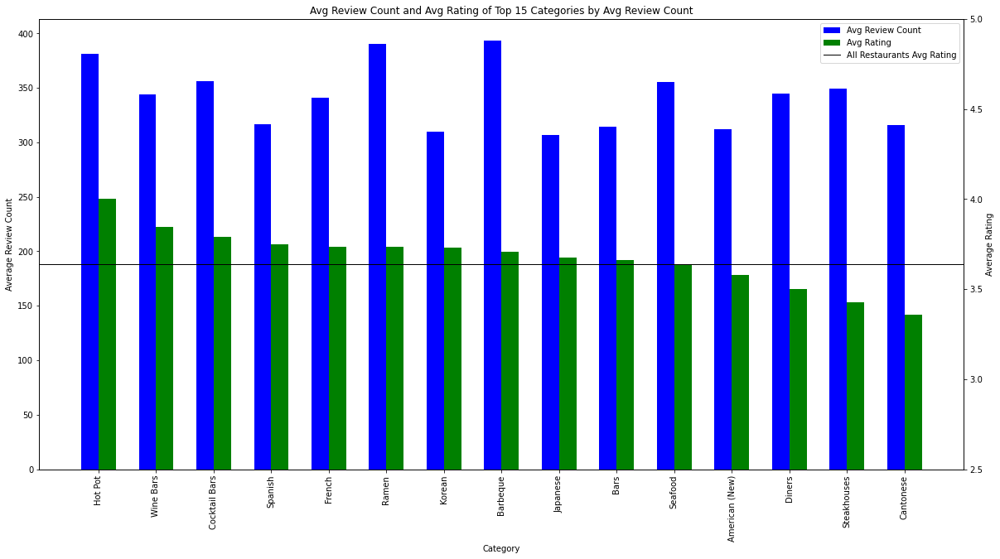

{
 "cells": [
  {
   "cell_type": "markdown",
   "metadata": {},
   "source": [
    "# DC Exurb Restaurant Analysis Using Yelp\n",
    "\n",
    "**Authors:** Jaclyn Dwyer and Gary Schwaeber\n",
    "\n",
    "\n",
    "\n",
    "## Overview\n",
    "The project explores where to open a new restaurant between the DC exurbs of Southern Maryland and Northern Virginia. Yelp data analyzes the success and popularity of different categories of restaurants within these areas. \n",
    "\n",
    "## Business Problem \n",
    "\n",
    "Yelp data is used to determine where to put a new restuarant between the MD and VA exurbs of DC as well as what type of restaurant. The goal is to find some category of restaurant where there is an untapped or underdeveloped market.\n",
    "\n",
    "## Data\n",
    "\n",
    "Yelp users contribute ratings and reviews based on their experiences at a given business. Data sourced from the Yelp API provides information about the cateogry, rating, price, review count, and address of each restaurant. \n",
    " - Review count measures popularity of a business.\n",
    " - Rating measures public opinion of a business. \n",
    " - The review data is used to anecdotally support the findings from the business search data.\n",
    " \n",
    "\n",
    "## Methods\n",
    "The categories for each restaruant are split and placed in separate columns and a new dataframe is created to capture the attributes for each category. The goal is to find a category of restaurants that have high review counts and low ratings. This would show a category where the existing restaurants are popular, but the public opinion of them is low. \n",
    "\n",
    "## Results\n",
    "Steakhouses and Cantonese restaurants have a high average review count and the lowest average rating. This shows an unmet satisfaction for restaruants in those categories.\n",
    "\n",
    "\n",
    "\n",
    "\n",
    "Steakhouses and Cantonese restaurant metrics are compared between each state to decide which category and where to place the new restaurant. \n",
    "\n",
    "  \n",
    "\n",
    "\n",
    "Median household income is higher in VA than MD counties.\n",
    "\n",
    "\n",
    "\n",
    "\n",
    "## Conclusion\n",
    "\n",
    "\n",
    "This analysis leads to the recommendation that a Dim Sum Cantonese restaurant in VA shows potential to be the most posperous.\n",
    " - Higher average review counts \n",
    " - Lower average ratings \n",
    " - Lower counts\n",
    " - Higher median household income in VA \n",
    " \n",
    "## Next Steps\n",
    "While the data supports opening a Dim Sum Cantonese restaurant in VA there are some things to further consider and explore. \n",
    " - Yelp data can only shed light on popularity and restaurant sentiment. It does not provide insight on potential profitability.\n",
    " - The length of how long a business has been open could bias the average review counts.\n",
    " - The current pandemic has changed dining trends which may not be reflected in the historical data from Yelp.\n",
    "\n",
    "\n",
    "## Repository Structure\n",
    "\n",
    "```\n",
    "├── data\n",
    "├── notebooks\n",
    "├── Images\n",
    "├── README.md\n",
    "├── Yelp_Final_Presentation.pdf\n",
    "└── Yelp_Final.ipynb\n",
    "```\n",
    "\n"
   ]
  }
 ],
 "metadata": {
  "kernelspec": {
   "display_name": "Python 3",
   "language": "python",
   "name": "python3"
  },
  "language_info": {
   "codemirror_mode": {
    "name": "ipython",
    "version": 3
   },
   "file_extension": ".py",
   "mimetype": "text/x-python",
   "name": "python",
   "nbconvert_exporter": "python",
   "pygments_lexer": "ipython3",
   "version": "3.8.3"
  }
 },
 "nbformat": 4,
 "nbformat_minor": 4
}
